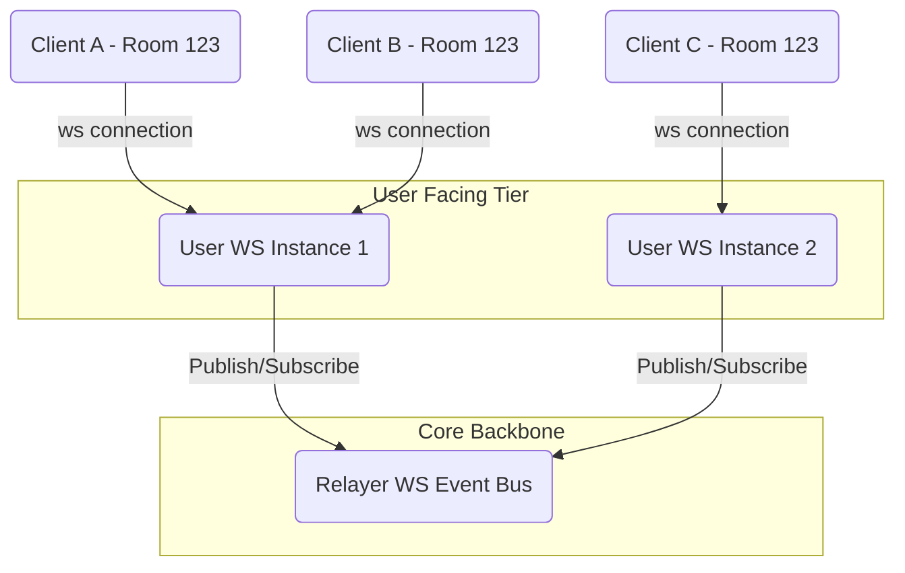
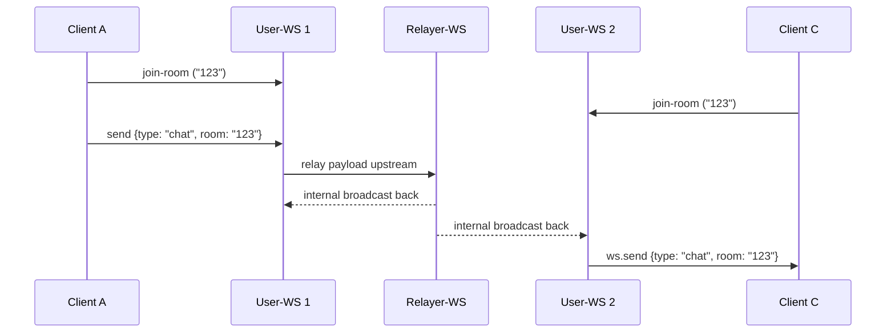

# Scale Chat - Scalable WebSocket Architecture

Scale Chat is designed to handle scalable real-time WebSocket connections across multiple server instances. The architecture prevents establishing a single point of failure or bottleneck by introducing a high-performance Pub/Sub mechanism through a relayer layer. This empowers thousands of concurrent users across dynamically scaled server clusters to communicate seamlessly within "rooms".

## Architecture & Data Flow

The system is fundamentally broken down into two core layers:
1. **User WebSocket Server (`user-ws`)**
2. **Relayer WebSocket Server (`relayer-ws`)**

### High-Level Topology Diagram

### 1. `user-ws` (User Entrypoint)
- **Role:** Handles incoming connections directly from client applications (such as browsers or mobile apps).
- **Use Case:**
  - Maintains a local map of `rooms` dynamically as clients connect.
  - Exposes port `8081` natively for endpoint client connections.
  - When a client issues a `join-room` payload, `user-ws` safely registers the WebSocket locally into that specific room array.
  - When a user sends a `chat` message to a particular room, `user-ws` forwards the data payload upstream to the central `relayer-ws`.
  - Concurrently, it listens for incoming broadcasts sent *down* from the `relayer-ws`. As those arrive, it searches its local `rooms` dictionary and natively transmits the identical payload to all matching client connections locally.

### 2. `relayer-ws` (The Real-time Event Bus)
- **Role:** Acts as the central synchronization hub (Pub/Sub message broker) tying all isolated instances of `user-ws` together.
- **Use Case:**
  - Exposes a dedicated internal port `3001` meant strictly for backend microservices.
  - Expects *only* `user-ws` servers to connect to it.
  - When *any* `user-ws` instance publishes a message payload to it, the `relayer-ws` uniformly iterates over its connections and blindly broadcasts (relays) that message out to *every single* registered `user-ws` server.
  - By distributing events back outwards, it guarantees state synchronization across disparate horizontally scaled server nodes. If Client A (on Node 1) messages Client C (on Node 2), the `relayer-ws` bridges the networking gap.

### Detailed System Event Sequence

1. **Client A** connects to **User-WS 1** and joins `room = "123"`.
2. **Client C** connects to **User-WS 2** and also joins `room = "123"`.
3. Client A initiates a chat: `{ "type": "chat", "room": "123", "message": "Hello Server!" }`.
4. **User-WS 1** receives this message block. It realizes it's a chat type and directly forwards the raw packet up to the **Relayer-WS**.
5. **Relayer-WS** observes the packet and transmits it uniformly across the backbone to all connected User-WS servers (User-WS 1 & User-WS 2).
6. **User-WS 2** ingests the relayed message, interpreting it as destined for room `123`. It filters its local client state, finds Client C, and pushes the payload directly.
7. Client C seamlessly receives the chat message generated by Client A.

## Tech Stack Overview

- **Node.js**: High-performance, asynchronous event-driven JavaScript runtime utilized natively to power our event loops for connections.
- **TypeScript**: Incorporating strict static typing and interfaces (like `Room`) to augment developer safety and cleanly define client/relay network contracts.
- **`ws`**: A highly-performant, battle-tested standard Node.js WebSocket library selected to efficiently manage all full-duplex, persistent streams required for zero-latency communication.
